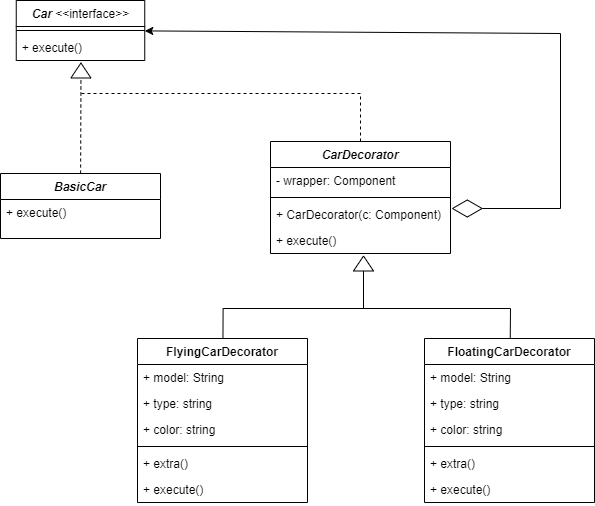

# Design Patterns

## Exercise 1 : Pattern Factory
- Modelization of a fruit salad. 
- Modelization of a fruit salad factory according to the seasons (winter or summer) (add it to your diagram). 
-  UML Diagram 

  
- Code of the exercise folder [FruitSalade](./FruitSalade/).

## Exercise 2: Pattern Prototype
- You're a mad scientist trying to create an army of 2-headed cats. You soon realize that it will take a long time to reproduce this animal in a modified form. So you decide to clone them.
- UML Diagram 

- Code of the exercise folder [CloneCat](./CloneCat/).

## Exercise 3: Pattern Decorator
- Model the construction of a car. The car can fly or float on water. There are only two components requiring modeling, the others being basic. 
	- There's a specific propulsion system for water or air. 
	- There is a navigation system specific to water or air.  
- UML Diagram 

- Code of the exercise folder [CarConstruction](./CarConstruction/).

## Exercise 4: Pattern Flyweight
- Model the creation of a toy catalog. A child should be able to choose toys by the thousands from your virtual catalog. (Obviously, you're not going to model a hundred toy classes - just create a few - but imagine that there are thousands of them, so you need to manage the heavy memory load of this catalog). The child chooses a toy and your system must display its characteristics. 
- UML Diagram

- Code of the exercise folder [ToyCatalog](./ToyCatalog/).